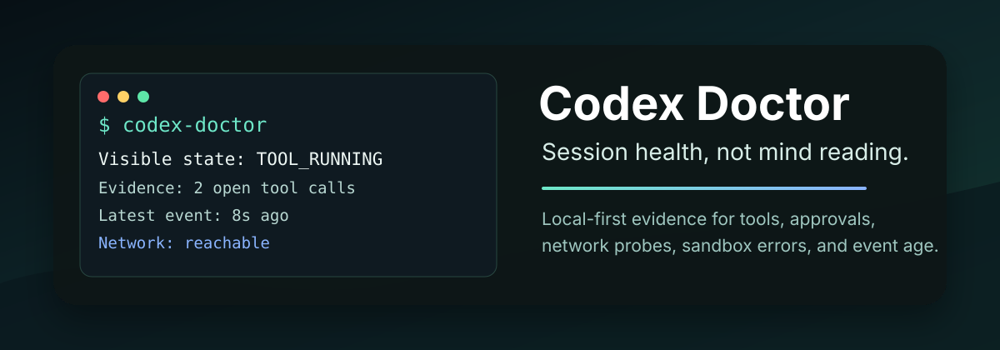

# Codex Doctor

[](https://github.com/Gmasterzhangxinyang/codex-doctor/actions/workflows/ci.yml)
[](https://www.python.org/)
[](LICENSE)
[](docs/privacy.md)



Know why Codex is thinking.

Codex Doctor is a local-first stuck notifier for Codex App. When Codex appears to be thinking for too long, it sends a macOS notification with the likely reason: network, API/model latency, approval, local tools, context compaction, sandbox policy, or a long-running command.

It does not read or reveal hidden model reasoning. It diagnoses observable runtime state only.

## Why This Exists

Sometimes Codex keeps showing `thinking` and the user has no idea what is happening.

Codex Doctor turns that vague state into a concrete diagnosis:

```text
Codex is running pytest, elapsed 7m32s, CPU 91%.
This is not a network issue.
```

or:

```text
Network looks healthy. api.openai.com returned 401 in 0.44s.
Codex is likely waiting for API/model response.
```

or:

```text
Codex is waiting for your approval.
Check the Codex UI for a permission prompt.
```

## Features

- Focused stuck feedback with `codex-doctor notify`.
- Best-effort Codex App activity detection from local session metadata.
- OpenAI network probe to separate connectivity issues from API/model waiting.
- macOS notifications when a stuck reason is detected.
- Local-first privacy model: no hidden reasoning, prompt text, or API keys are collected.

## Install

```bash
pipx install codex-doctor
codex-doctor install
```

For local development:

```bash
git clone https://github.com/Gmasterzhangxinyang/codex-doctor.git
cd codex-doctor
python -m pip install -e ".[dev]"
```

## Quick Start

For Codex App users, run the small stuck notifier:

```bash
codex-doctor notify
```

Test whether macOS notifications are actually allowed on your machine:

```bash
codex-doctor notify --test
```

Make it report faster:

```bash
codex-doctor notify --after 20
```

That is the main workflow: keep it open while using Codex App. It sends a macOS
notification only when Codex Doctor thinks Codex is stuck and can explain why.
If macOS notifications are blocked, Codex Doctor prints the stuck feedback in
the terminal instead of pretending the popup worked.

For a one-shot debug check:

```bash
codex-doctor diagnose
```

Advanced debug commands such as `diagnose`, `monitor`, `watch`, `run`, and `report`
are kept for maintainers, but the product surface is `codex-doctor notify`.

## Diagnosis States

| State | Meaning |
|---|---|
| `NETWORK_SUSPECTED` | DNS, TCP, TLS, proxy, VPN, or firewall may be blocking the request. |
| `API_OR_MODEL_WAITING` | Network is reachable; Codex is likely waiting on API/model response. |
| `TOOL_RUNNING` | Codex is waiting for a local command or tool to finish. |
| `APPROVAL_WAITING` | Codex needs user approval before continuing. |
| `CONTEXT_COMPACTING` | Codex is compacting long-session context. |
| `SANDBOX_OR_PERMISSION_BLOCKED` | A command likely hit sandbox or permission policy. |
| `DONE` | The session stopped normally. |
| `ERROR` | The session ended with an error signal. |

Every diagnosis includes confidence: `HIGH`, `MEDIUM`, or `LOW`.

## How It Works

Codex Doctor combines local evidence sources:

1. Codex lifecycle hooks.
2. PTY wrapper terminal activity.
3. Local process-tree samples.
4. OpenAI network probes.

Those signals feed a small state machine that emits stuck feedback.
When Codex App does not emit hooks for a visible App session, Codex Doctor falls
back to the latest local session file and reads only safe event metadata such as
`reasoning`, `function_call`, and `function_call_output`.

See [Architecture](docs/architecture.md) and [Event Model](docs/events.md).

## Privacy Model

Codex Doctor is local-first.

- No cloud upload.
- No API key interception.
- No hidden chain-of-thought access.
- No network request from hooks.
- OpenAI probes do not send credentials.
- Prompt and tool content are redacted and truncated by default.
- Tool input is stored as a small snippet plus SHA-256 hash.

See [Privacy](docs/privacy.md) and [Security Policy](SECURITY.md).

## Commands

```bash
codex-doctor install
codex-doctor notify
codex-doctor notify --test
codex-doctor notify --after 20
codex-doctor diagnose
codex-doctor uninstall
```

## Optional Codex Plugin

The optional plugin package lives in [`plugin/`](plugin/). It provides lifecycle hooks and a `diagnose-codex` skill. The notifier remains the main user-facing workflow.

See [Plugin Install](docs/plugin-install.md).

## Development

```bash
python -m pip install -e ".[dev]"
python -m ruff check .
python -m pytest
python -m build
```

## Roadmap

See [Roadmap](docs/roadmap.md).

## Contributing

Contributions are welcome. Please read [CONTRIBUTING.md](CONTRIBUTING.md), especially the privacy and safety boundaries.

## Uninstall

```bash
codex-doctor uninstall
```

Historical data is kept unless explicitly purged:

```bash
codex-doctor uninstall --purge-data
```

## License

MIT. See [LICENSE](LICENSE).
